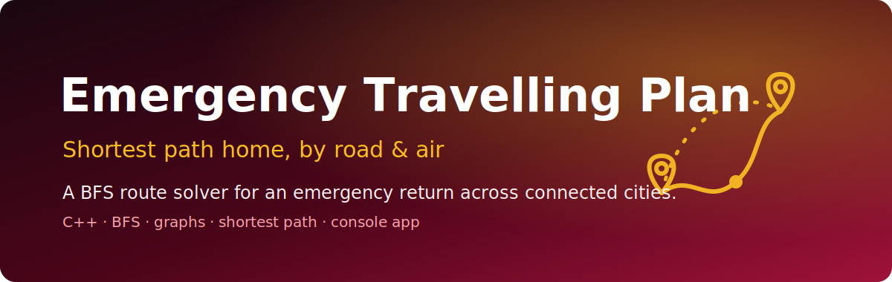

<p align="center">
  
</p>

<h1 align="center">Emergency Travelling Plan</h1>

<p align="center"><em>Find the minimum number of days to get home, across cities linked by road and air.</em></p>

<p align="center">
  
  
  
  
  
</p>

A single-file **C++** console program that solves a "race home" routing puzzle: a traveller gets an emergency call and must return from their current city to the office in the fewest days possible. Cities are chained together by **road** edges, and some pairs are linked by faster **aerial** routes. The program models this as a weighted graph and runs a **breadth-first search (BFS)** to compute the shortest route and the day count.

> When the call comes, you don't want the prettiest route — you want the fastest one. This is the textbook shortest-path problem dressed up as an emergency.

---

## ✨ Features

- **Self-contained C++** — one source file, only the standard library, no external dependencies.
- **Custom data structures** — a hand-rolled array-backed `Queue` and a `Graph` class built on adjacency matrices (no STL containers).
- **Dual edge types** — separate adjacency matrices for **road** connections (`adj`) and **aerial** connections (`air`).
- **BFS shortest path** — explores the graph level by level, tracking distances and predecessors so it can reconstruct the route.
- **Path reconstruction** — a recursive `printPath` walks the `prev[]` chain to print the city sequence from source to destination.
- **Multi-test-case input** — reads a number of test cases up front and solves each independently.

## 🏗️ How it works

The traveller starts at city `1` and must reach the last city `n`. Cities are wired up sequentially by road (`i → i+1`), and additional aerial routes are supplied at runtime.

```
        road (cost +1 each)            aerial (no day cost)
   [0] --→ [1] --→ [2] --→ ... --→ [n-1]
            \________________________/
                 air[u][v] hop

   BFS from src=0:
     • air  edge  → distances[v] = distances[u]      (same-day hop)
     • road edge  → distances[v] = distances[u] + 1   (advance one step)
     • prev[v] records the predecessor for path reconstruction
```

- The `Graph` constructor allocates the road matrix `adj`, the aerial matrix `air`, a `distances[]` array (initialised to `MAX`), and a `prev[]` array.
- `addEdge(u, v)` registers a road link; `addAirEdge(u, v)` registers an aerial link.
- `bfs(src, dest)` enqueues the source, then relaxes neighbours: aerial edges carry no extra distance, road edges add `1`. It returns `distances[dest]`.
- `main()` post-processes the raw distance into a day estimate with `days = (days / 6) + (m / 2)`, reflecting the rule that a traveller can cover up to 6 road cities per day, with aerial hops factored in.

> Note: this is a coursework / educational solver. The distance-to-days conversion and the sequential-road assumption are specific to the assignment's problem statement rather than a general TSP/route optimiser.

## 🚀 Run it

No build system or libraries are required — just a C++ compiler.

```bash
# compile (g++)
g++ "Emergency Travelling Plan.cpp" -o emergency-plan

# run
./emergency-plan
```

Or with MSVC on Windows:

```bat
cl "Emergency Travelling Plan.cpp"
"Emergency Travelling Plan.exe"
```

### Example session

The program prompts interactively for the number of test cases, then for each case the number of cities, the number of aerial routes, and the `u v` pairs:

```
Enter the number of test cases: 1
Enter the number of cities: 30
Enter the number of aerial routes: 1
2 21
Path: 0 1 2 21 22 ... 29
Shortest days from city 1 to city 30: 3
```

## 🔧 Input format

| Prompt | Meaning |
| --- | --- |
| number of test cases | how many scenarios to solve in a row |
| number of cities `n` | cities are indexed `0..n-1` and chained by road |
| number of aerial routes `m` | how many `u v` aerial pairs follow |
| `u v` (×`m`) | a directed aerial route from city `u` to city `v` |

Constants live at the top of the source: `#define MAX 1000` sets both the queue capacity and the "infinite" initial distance.

## 👤 Author

Muhammad Usman
